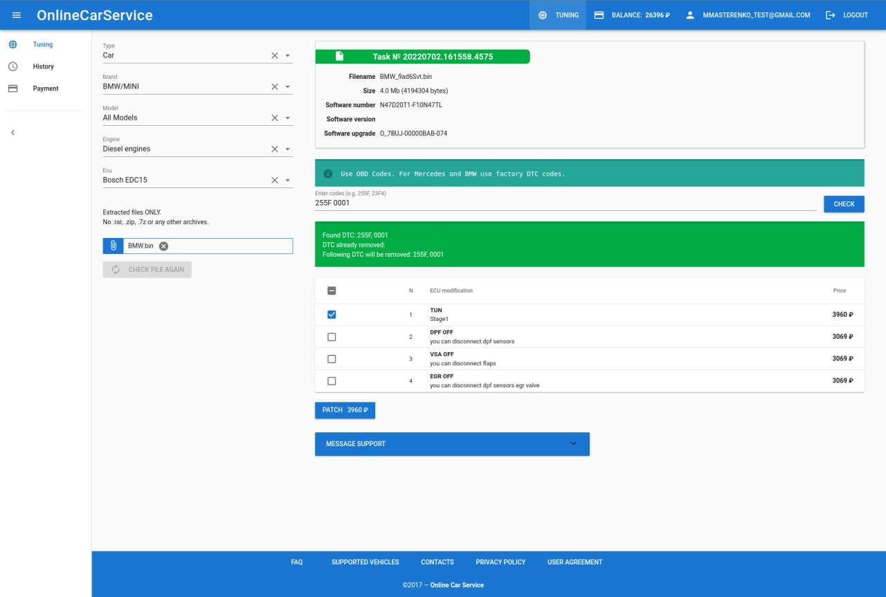
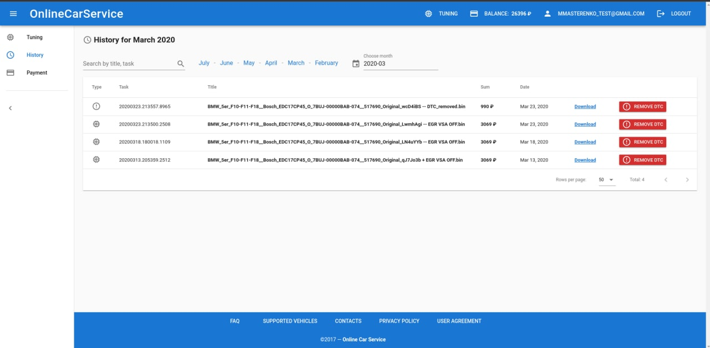

# Ответы на вопросы

## 1. Главная


Логотип не нужен

**Menu:**

- Advantages
- Contacts

Слоган: Tune it fast.

Для зарегистрированного пользователя:
вверху появляется navigation bar (выделенный отдельным цветом).


- Заказ можно сделать только после регистрации ?
- Да, нужно залогиниться.
---
- Можно выбрать услугу и сделать заказ? Или нужно  заполнить формы и остаавить заявку на просчет?
- Оставить заявку нельзя. Форма не нужна.
---
- и для чего делают чип тюнинг? Для повышения мощности двигателя автомобиля или исправления заводских ошибок  в программах
- Для повышения мощности двигателя. 
---
- Иллюстрация – машина + чип + дисплей, на котором улучаются показатели?
- Да, можно так
---
- Как чип выглядит?
- Можно оставить как вы нарисовали.
---
- Чип-тюнинг - изменения параметров работы двигателя, за счёт внесения изменения в прошивку контроллера.
Но как вы написали, тоже подходит.
---
- кнопка на страницу со всеми услугами, ценами, пр
имерами работ?
- Не надо, нет такой страницы
---
- Контакты и отправить форму ?
- Контакты можно взять со старого сайта. Форма не нужна.
---
- Телефона нет. Email: support@easytun.com

## 2. Восстановление пароля

Пользователь вводит почту, на нее отправится ссылка со сбросом пароля

## 3. Шаблон

Шаблонная страница.
Похоже тут нужны 2 шаблона:
- шаблон для анонимных пользователей
- шаблон для зарегистрированных пользователей

Когда пользователь логинится, в дизайне должен быть акцент. Например, верхний navigation-bar выделяется цветом и там появляются ссылки:
- `Balance: 100 $`        - ссылка на страницу payment
- `user@email.com`        - просто логин (не ссылка)
- `<settings_icon>`       - ссылка на страницу profile
- `Tuning`                - ссылка на страницу tuning

## 4. Пользовательское соглашение 

## 5. Политика конфиденциальности

## 6. Транспортные средства

Support vehicles - этот раздел не нужен

Изначально мы хотели здесь перечислить все бренды, как в https://www.morendi.ru/categories/chip-tiuning


## 7. Контакты

Пока такие, но они поменяются в будущем.
Возможно банковские реквизиты сократим до номера счёта.

```
ORGANIZATION IE Plyshevskij Alexander Sergeevich
INN / PSRN 025551261000 / 316028000097627
EMAIL support@easytun.com
REGISTERED OFFICE 452027, Russian Federation, Republic of Bashkortostan, Belebeevsky district, Annovka village, Molodezhnaja street, 6
ACCOUNT NUMBER 4080 2810 1060 0001 3713
BANK ADDRESS Bashkirskoe otdelenie №8598 PAO Sberbank g. Ufa
```


## 8. Оплата

Это страница только для залогиненых.
Здесь такой же шаблон как для:
https://onlinecarservice.ru/panel/payment


Ваш логин/пароль для входа:
```
maria@mail.ru / allyouneedislove
```


## 9. Настройки

Это страница только для залогиненых.
Здесь такой же шаблон как для:
https://onlinecarservice.ru/panel/profile


## 10. Тюнинг

Это страница только для залогиненых.
Здесь такой же шаблон как для:
https://onlinecarservice.ru/panel/tuning




## 11. История

Это страница только для залогиненых.
Здесь отображается история заказов.
Здесь такой же шаблон как для:
https://onlinecarservice.ru/panel/history




## 12. Регистрация

Чтобы зарегистрироваться пароль не нужен.
- Пользователь вводит email
- после чего ждет когда к нему на почту придёт разовый пароль
- после чего вводит пароль в форму

На форме регистрации, после нажатия на кнопку Register появляется поле для ввода пароля (с надписью `Password was sent. Check your email, please`)

Установить пароль пользователь может сам в настройках.


## 13. Логин

Да, пользователь может войти как с помощью личного пароля, так и одноразового.


## скриншоты

https://github.com/mmasterenko/new-design/tree/main/images

